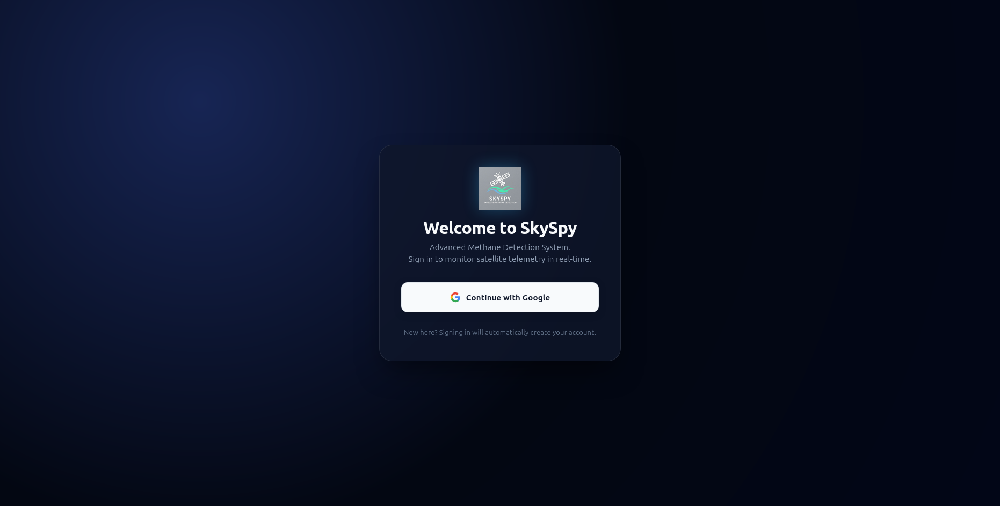
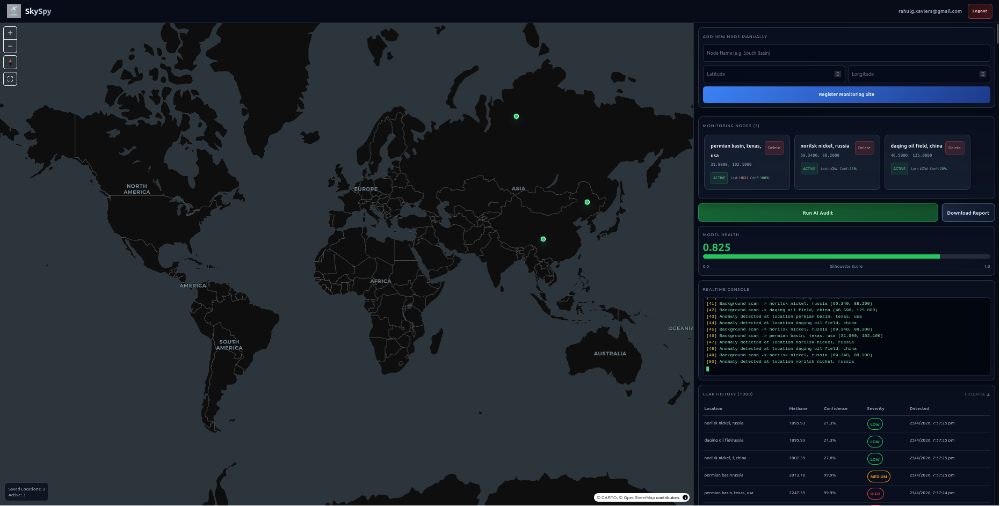

# SkySpy: The Satellite Methane Sentinel

SkySpy is a sophisticated monitoring platform designed to detect methane gas anomalies and leaks through satellite-driven data analysis. By leveraging advanced machine learning algorithms and real-time monitoring, SkySpy provides industrial operators and environmental agencies with the tools needed to identify and mitigate invisible climate-threatening emissions.

## Overview

Methane is a potent greenhouse gas, and early detection of leaks is critical for both environmental preservation and industrial safety. SkySpy automates the detection process by analyzing methane concentration patterns across geographical coordinates. Using an Isolation Forest algorithm, the system identifies statistical anomalies that signify potential leaks, providing a confidence score and severity assessment for each detection.

## Key Features

- Real-Time Anomaly Detection: Automated background processing that scans active locations for methane spikes.
- Machine Learning Integration: Utilizes scikit-learn Isolation Forest for robust statistical anomaly detection.
- Interactive Map View: Visualize monitored locations and active leak logs on a dynamic geospatial interface.
- Location Management: Complete dashboard for adding, updating, and monitoring specific industrial or environmental sites.
- Automated Alerts: System automatically logs detections with confidence metrics and severity levels (Medium to High).
- Secure Data Management: Integrated with Supabase for reliable storage and real-time data synchronization.

## Technology Stack

### Backend
- Framework: FastAPI (Python)
- Machine Learning: scikit-learn (Isolation Forest)
- Data Processing: NumPy, Pandas
- Communication: HTTPX for asynchronous Supabase interaction
- Concurrency: Asyncio for background monitoring loops

### Frontend
- Framework: React with TypeScript
- Build Tool: Vite
- Geospatial: Interactive Map components
- State and Database: Supabase Client
- UI: Modern dark-themed industrial dashboard

## Getting Started

### Prerequisites
- Python 3.9 plus
- Node.js 18 plus
- Supabase Project with required schema (locations and leak_logs tables)

### Backend Setup
1. Navigate to the backend directory.
2. Install dependencies using pip install -r requirements.txt.
3. Configure environment variables for SUPABASE_URL and SUPABASE_SERVICE_ROLE_KEY.
4. Run the server with uvicorn main:app --reload.

### Frontend Setup
1. Navigate to the frontend directory.
2. Install dependencies using npm install.
3. Configure environment variables in the .env file.
4. Start the development server with npm run dev.

## Vision and Impact

SkySpy aims to bridge the gap between satellite data and actionable industrial insights. By making methane detection accessible and automated, we empower organizations to achieve their sustainability goals and protect the atmosphere from fugitive emissions.

## Outputs

### 1. Login Interface

### 2. Monitoring Dashboard
